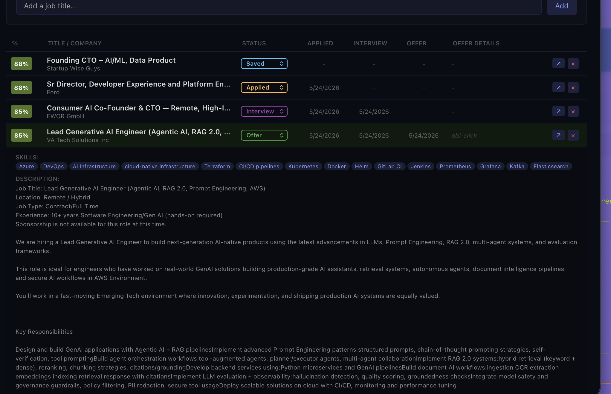
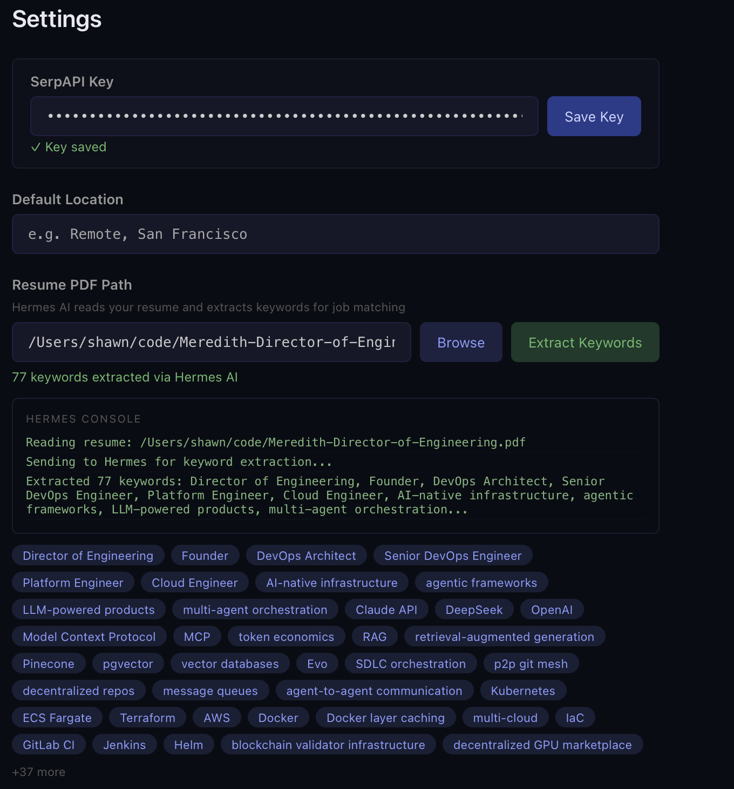
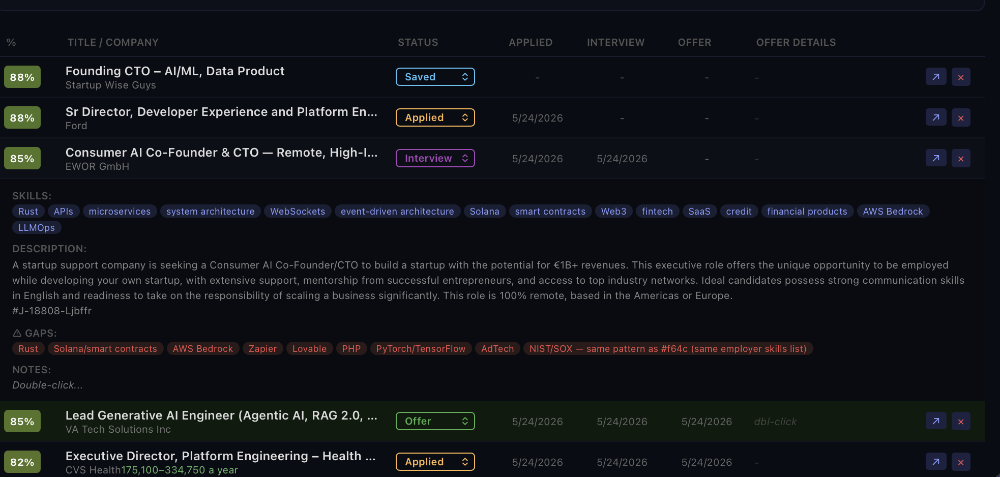
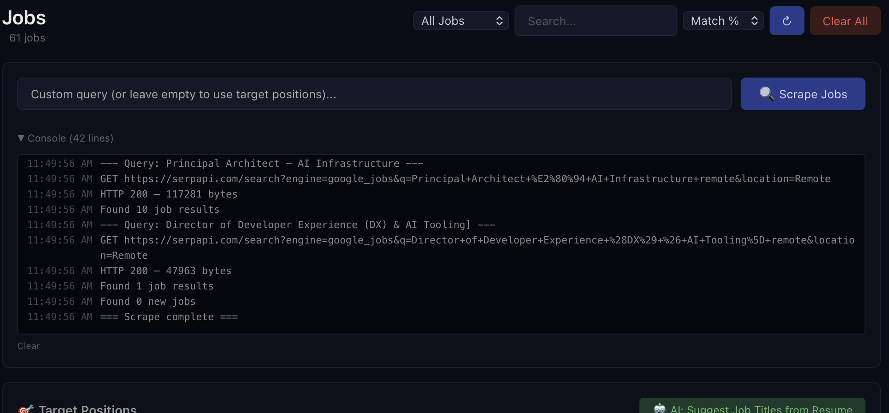
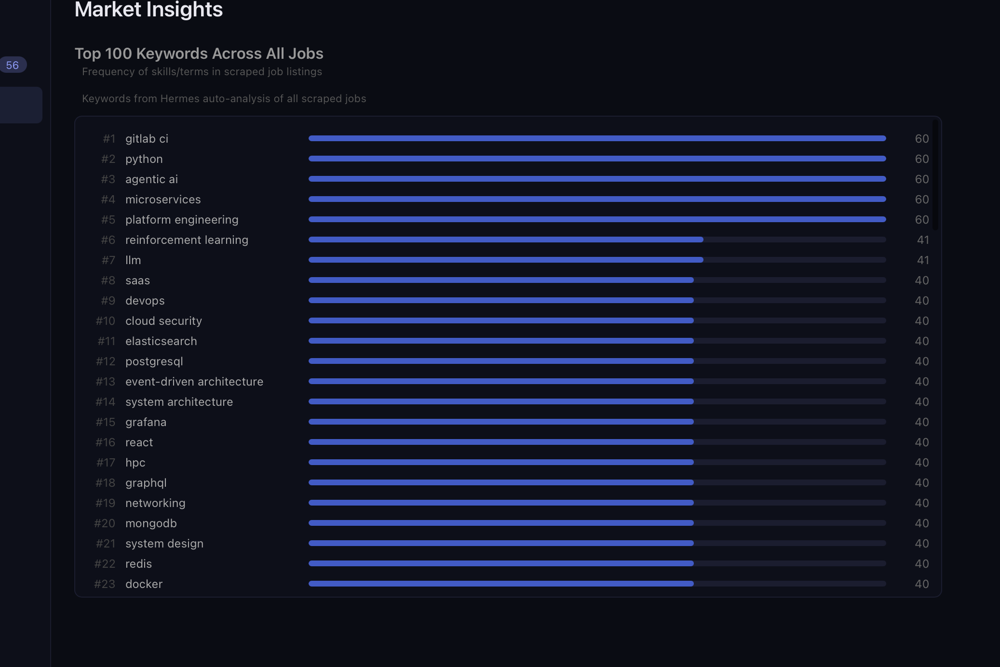

# JobDash

AI-powered job search and application tracker. Scrape jobs, extract resume keywords with AI, match and filter listings, track your pipeline from discovery to offer — all in a native desktop app.

Built with [Wails v3](https://v3.wails.io/) (Go + Svelte). Project intelligence managed by [Evo](https://github.com/purfect-labs/evo) — the engineering brain for AI-first teams.

## Features

- **AI Resume Parsing** — Upload your PDF resume. Hermes (local LLM) extracts 40-60 keywords automatically.
- **Smart Job Scraping** — Searches Google Jobs via SerpAPI. Multi-query support with deduplication.
- **Match Scoring** — 4-level keyword matching engine scores every job 0-100 against your resume.
- **Remote Filter** — Automatic remote/hybrid/on-site classification with positive/negative keyword scoring.
- **Gap Analysis** — Per-job skill gap analysis comparing your resume against each listing.
- **Market Analysis** — Aggregated market trends across all scraped jobs.
- **Pipeline Tracking** — Full pipeline: New → Saved → Applied → Interviewing → Offer.
- **100% Local** — SQLite database, no cloud accounts, no data leaves your machine.

## Screenshots

| Dashboard | Settings |
|-----------|----------|
|  |  |

| Jobs | Scraper |
|------|---------|
|  |  |

| Insights |
|----------|
|  |

## Download

Pre-built binaries for macOS, Linux, and Windows from [Releases](https://github.com/purfect-labs/jobdash/releases).

## Quick Start

### Prerequisites

| Dependency | Install | Purpose |
|-----------|---------|---------|
| Go 1.25+ | [go.dev/dl](https://go.dev/dl/) | Backend runtime |
| Node.js 22+ | [nodejs.org](https://nodejs.org/) | Frontend build |
| Python 3 + pymupdf | `pip install pymupdf` | Resume PDF parsing |
| **Hermes CLI** | [Install guide](https://github.com/nousresearch/hermes-agent#installation) | AI keyword extraction, gap analysis, market analysis |
| **SerpAPI key** | [serpapi.com](https://serpapi.com) (free tier: 100 searches/month) | Google Jobs scraping |

**Hermes setup** (one-time):
```bash
pip install hermes-agent        # or: brew install hermes-agent
hermes setup                    # configure your LLM provider + API key
hermes model                    # set default model (e.g. deepseek-chat)
```

**SerpAPI setup** (one-time):
1. Sign up at [serpapi.com](https://serpapi.com) — free tier gives 100 searches/month
2. Copy your API key from the dashboard
3. Paste it in JobDash Settings → SerpAPI Key, or add to `~/.jobdash/.env`:
   ```
   SERP_API_KEY=your_key_here
   ```

**One-liner:** `./dep-install.sh` installs Go, Node, Python, pymupdf, and Wails3 CLI.

```bash
# Clone
git clone https://github.com/purfect-labs/jobdash.git
cd jobdash

# Install system dependencies
./dep-install.sh

# Install frontend deps
cd frontend && npm install && cd ..

# Run in dev mode
go install github.com/wailsapp/wails/v3/cmd/wails3@latest
wails3 dev

# Build for production
task build
```

### Build from source (no Wails CLI)

```bash
cd frontend && npm install && npm run build && cd ..
CGO_ENABLED=1 go build -o jobdash .
./jobdash
```

The frontend must be built first (`npm run build`) so it's embedded in the Go binary.

## Configuration

Paste your SerpAPI key in the Settings panel, or create `~/.jobdash/.env`:
```
SERP_API_KEY=your_serpapi_key
```

All job data is stored in `~/.jobdash/jobs.db` (SQLite, auto-created on first run).

## Architecture

```
jobdash/
├── main.go              # Wails v3 entry point
├── service.go           # JobService — core business logic (17 API methods)
├── scraper/
│   └── engine.go        # SerpAPI client, Hermes AI, keyword matching
├── db/
│   └── jobs.go          # SQLite schema, CRUD, keyword storage
├── frontend/
│   └── src/
│       └── lib/components/
│           ├── Dashboard.svelte      # Job pipeline board
│           ├── JobCard.svelte        # Individual job display
│           ├── PositionManager.svelte # Job title queries
│           ├── ScraperPanel.svelte   # Scrape controls + logs
│           ├── Insights.svelte       # Keyword stats + analysis
│           └── Settings.svelte       # Config panel
├── build/               # Cross-platform build configs
└── .evolution/          # Evo project intelligence
```

## How It Works

1. **Upload Resume** → Hermes reads PDF → extracts 40-60 keywords → stored in SQLite
2. **Recommend Positions** → Hermes suggests 5-8 job titles to search for
3. **Scrape Jobs** → SerpAPI Google Jobs search → dedup via SHA256 → compute match scores
4. **Filter Remote** → Keyword-based classification → Hermes keyword analysis on matches
5. **Review Pipeline** → Dashboard shows jobs with match scores, gap analysis, status tracking
6. **Market Analysis** → Hermes analyzes top 20 jobs for trends and skill gaps

## Tech Stack

- **Backend**: Go 1.25, Wails v3 alpha
- **Frontend**: Svelte, Vite
- **Database**: SQLite (modernc.org/sqlite — pure Go, no CGO)
- **AI**: Hermes CLI (local LLM agent)
- **Job Search**: SerpAPI (Google Jobs)
- **PDF**: Python 3 + pymupdf

## License

MIT — see [LICENSE](LICENSE)
